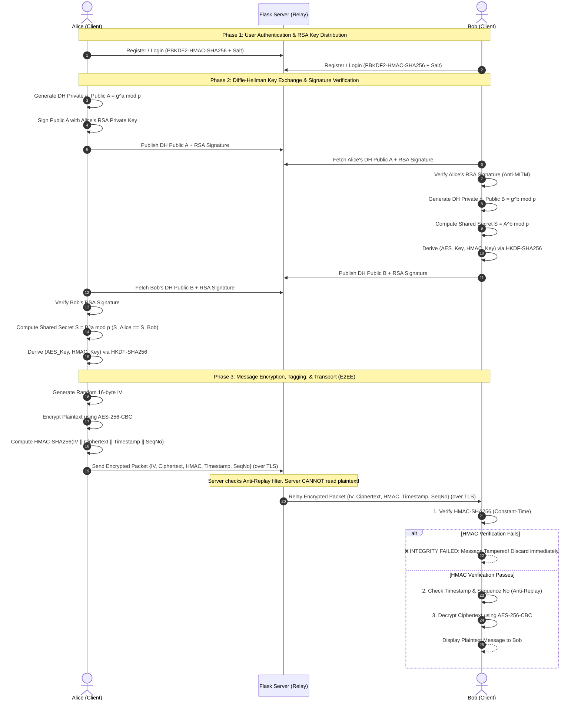

# Secure End-to-End Messaging System Using Hybrid Cryptography

### Subtitle
*Implementation of Diffie–Hellman Key Exchange, AES Encryption, HMAC-Based Integrity, and TLS-Secured Communication*

---

## 1. Project Overview & Problem Statement

### Problem Statement
Traditional message transmission over untrusted networks exposes users to severe security threats:
- **Eavesdropping / Packet Sniffing**: Plaintext messages exposed on intermediaries or insecure Wi-Fi.
- **Message Tampering**: Unauthorized modification of message content in transit.
- **Man-in-the-Middle (MITM) Attacks**: Adversaries intercepting unauthenticated key exchanges.
- **Replay Attacks**: Attackers capturing legitimate encrypted packets and re-transmitting them.

### Proposed Solution
This project implements an educational **Secure End-to-End Encrypted (E2EE) Messaging System** using **Hybrid Cryptography**. Two users (**Alice and Bob**) establish secure symmetric session keys over an untrusted channel using **Diffie–Hellman (DH) Key Exchange**, separate encryption and integrity keys using **HKDF-SHA256**, protect message confidentiality using **AES-256-CBC**, ensure integrity using **HMAC-SHA256** (Encrypt-then-MAC), authenticate DH public parameters using **RSA-2048 Digital Signatures**, and encrypt transport traffic using **TLS 1.3 / HTTPS**.

> **Key Architectural Principle:** The relay server routes only encrypted ciphertext, IVs, HMAC tags, and timestamps. **The server NEVER learns or stores plaintext messages or symmetric session keys.**

---

## 2. System Architecture & Message Flow



---

## 3. Cryptographic Primitives & Justifications

| Security Requirement | Cryptographic Primitive | Parameter / Standard | Engineering Justification |
| :--- | :--- | :--- | :--- |
| **Confidentiality** | **AES** | AES-256-CBC with PKCS#7 | NIST standard symmetric block cipher. 256-bit key ensures military-grade security. CBC mode with unique 16-byte IV per message prevents pattern leaks. |
| **Message Integrity** | **HMAC** | HMAC-SHA256 (Encrypt-then-MAC) | Cryptographic MAC provides tamper detection and message authenticity. Verifies ciphertext, IV, timestamp, and sequence number before decryption. |
| **Key Establishment** | **Diffie–Hellman** | RFC 3526 MODP-2048 ($g=2$) | Enables two parties to establish a common secret over an insecure channel without transmitting the secret itself. |
| **Key Separation** | **HKDF** | HKDF-SHA256 (RFC 5869) | Prevents cryptographic cross-protocol attacks by deriving separate, independent keys for encryption ($K_{\text{enc}}$) and integrity ($K_{\text{mac}}$). |
| **User Authentication** | **Password Hashing** | PBKDF2-HMAC-SHA256 (100k rounds + 16B salt) | OWASP recommended password storage mechanism. Resists rainbow table lookups and brute-force GPU cracking. |
| **MITM Prevention** | **Digital Signatures** | RSA-2048 with PSS & SHA-256 | Binds DH public values to user identities. Prevents adversary substitution of public keys. |
| **Replay Protection** | **Nonce / Sequence** | Message ID, ISO Timestamp, Sequence # | Server and client record processed message IDs. Duplicate or stale packets are rejected. |
| **Transport Security** | **TLS / HTTPS** | TLS v1.3 with X.509 Certificate | Protects the underlying transport channel against network sniffing and traffic analysis. |

---

## 4. Attack Demonstrations & Security Analysis

The project includes an **Interactive Attack & Defense Laboratory** (available via Web UI at `/attacks` and CLI via `python attacks/attack_simulator.py`):

### Attack 1: Plaintext Interception / Eavesdropping
- **Vulnerability**: In unencrypted HTTP transmission, packet sniffers (Wireshark) observe the full plaintext message, credentials, and session tokens.
- **Defense**: TLS 1.3 encrypts the transport channel, and application-layer AES-256-CBC ensures that even if TLS terminates at an untrusted proxy or server, the message remains encrypted.

### Attack 2: Message Tampering (Integrity Test)
- **Vulnerability**: An active attacker modifies 1 bit or byte of the ciphertext during transit (e.g. changing `$100` to `$900`).
- **Defense**: Recipient executes constant-time HMAC-SHA256 verification before decryption. Any alteration in ciphertext, IV, timestamp, or sequence number triggers `❌ INTEGRITY CHECK FAILED`, safely discarding the payload before AES decryption.

### Attack 3: Replay Attack (Anti-Replay Test)
- **Vulnerability**: An adversary captures a valid encrypted transaction packet (e.g. "Authorize Transfer") and retransmits it to duplicate the action.
- **Defense**: The system tracks processed `message_id`s and sequence numbers. Retransmitted packets are immediately flagged with `REPLAY_ATTACK_DETECTED` (HTTP 409 Conflict) and discarded.

### Attack 4: Man-in-the-Middle on Diffie-Hellman
- **Vulnerability**: Unauthenticated Diffie-Hellman is susceptible to MITM because Alice and Bob have no proof of who generated the public keys $A$ and $B$. Eve intercepts and substitutes her own keys ($A', B'$), establishing independent shared secrets with both parties.
- **Defense**: Authenticated Diffie-Hellman using **RSA-2048 Digital Signatures**. Alice signs her public value $A$ with her RSA private key. When Eve substitutes $A$ with $E_A$, Eve cannot forge Alice's signature. Bob verifies the signature using Alice's registered public key and aborts the connection upon signature mismatch.

---

## 5. Course Outcomes (CO) Mapping

| Course Outcome | Project Implementation |
| :--- | :--- |
| **CO1: Cryptographic algorithms, authentication and key management** | Modular implementation of AES-256, Diffie-Hellman MODP-2048, HKDF-SHA256, and PBKDF2 password hashing. |
| **CO2: Access and security mechanisms** | User session management, role isolation, anti-replay filters, and RSA identity authentication. |
| **CO3: Secure communication protocols** | Native TLS 1.3 / HTTPS implementation with self-signed X.509 certificates and Encrypt-then-MAC transport. |
| **CO4: Implement and evaluate cryptographic/network security algorithms** | Complete messaging system with automated test suites (`test_crypto.py`, `test_attacks.py`) and live attack simulator. |

---

## 6. How to Run & Verify

### Prerequisites
- Python 3.10+ (Tested on Python 3.14)
- Dependencies: `pip install -r requirements.txt` (`Flask`, `cryptography`)

### 1. Launch Server in Standard HTTP Mode
```bash
python app.py
```
- Open browser: `http://127.0.0.1:5000`
- Features split-screen **Dual-Client Simulator** (Alice on left, Bob on right).

### 2. Launch Server in Secure HTTPS/TLS Mode
```bash
python app.py --https
```
- Automatically generates self-signed TLS certificates (`cert.pem`, `key.pem`).
- Open browser: `https://127.0.0.1:5443` (accept self-signed warning).

### 3. Run Automated Unit Tests (100% Pass Rate)
```bash
python -m unittest discover -s tests
```
Runs 11 automated test cases verifying:
- PBKDF2 password hashing with salt & constant-time validation
- Diffie-Hellman mathematical key agreement ($S_A == S_B$)
- HKDF key separation
- AES-256-CBC encryption/decryption round-trip
- HMAC-SHA256 integrity check and tamper rejection
- RSA-2048 PSS signature verification and forgery rejection
- Replay attack detection
- Server database zero-plaintext guarantee

### 4. Run Terminal Attack Simulation Runner
```bash
python attacks/attack_simulator.py
```
Executes interactive terminal demonstrations of all 4 attack scenarios with detailed cryptographic telemetry.

---

## 7. Project Directory Structure

```text
d:\CNS_Project/
├── app.py                      # Main entrypoint; Flask server (HTTP and HTTPS modes)
├── database.py                 # SQLite database schema, user store, and relay tables
├── generate_cert.py            # Self-signed TLS/X.509 certificate generator
├── requirements.txt            # Python dependencies
├── README.md                   # Complete architectural documentation & viva cheat sheet
│
├── crypto/                     # Core Cryptographic Primitives
│   ├── __init__.py
│   ├── auth.py                 # PBKDF2-HMAC-SHA256 password hashing & salt
│   ├── dh.py                   # RFC 3526 MODP-2048 Diffie-Hellman key exchange
│   ├── kdf.py                  # HKDF-SHA256 key derivation (AES key & HMAC key)
│   ├── encryption.py           # AES-256-CBC encryption/decryption with PKCS#7
│   ├── integrity.py            # HMAC-SHA256 integrity tag generation & verification
│   └── signatures.py           # RSA-2048 PSS digital signatures (Anti-MITM)
│
├── routes/                     # Backend REST API Routes
│   ├── __init__.py
│   ├── auth_routes.py          # /api/auth/register, /login, /logout, /users
│   ├── dh_routes.py            # /api/dh/initiate, /respond, /client helpers
│   ├── message_routes.py       # /api/messages/send, /receive, /server/relay-log
│   └── attack_routes.py        # /api/attacks/tamper, /replay, /mitm, /eavesdrop
│
├── attacks/                    # Attack Simulation Tools
│   ├── __init__.py
│   └── attack_simulator.py     # Standalone terminal attack runner
│
├── static/                     # Frontend Assets
│   ├── css/
│   │   └── style.css           # Modern cybersecurity UI stylesheet
│   └── js/
│       ├── crypto_client.js    # Client-side cryptographic manager
│       └── chat.js             # Dual-panel real-time chat & inspector logic
│
├── templates/                  # Frontend HTML Templates
│   ├── index.html              # Landing page & Dual-Client Simulator
│   ├── login.html              # Authentication & registration UI
│   ├── chat.html               # Full-screen E2EE chat with Live Crypto Inspector
│   └── attack_demo.html        # Interactive Attack & Defense Laboratory
│
└── tests/                      # Automated Test Suite
    ├── test_crypto.py          # Cryptographic primitive unit tests
    └── test_attacks.py         # Attack defense and security validation tests
```
